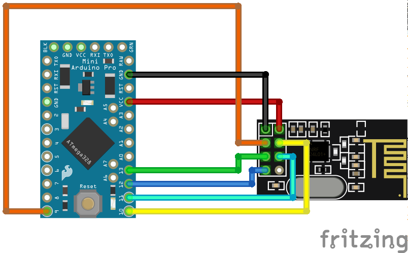

# Überblick

## Beute
An der Beute wird gemessen:
* Gewicht
* Akkustand

Benötigte Komponenten:
* arduino pro mini 3.3v
* Wiegezelle (Bosche H30)
* HX711
* nrf24l01(+)

## Gateway
Am Gateway wird gemessen:
* Temperatur
* Luftfeuchtigkeit
* Luftdruck
* Akkustand

### Benötigte Komponenten:
* nrf24l01(+)
* BME280
* SIM800

### Verkabelung

## Server
Die empfangenen Messwerte werden in einer InfluxDB abgelegt und mit Grafana visualisiert

Verwendete Software:
* MQTT Broker: mosquitto
* influxDB
* Grafana

## Kommunikationswege
### Beute -> Gateway
Einfache Kommunikation via NRF Module

### Gateway -> Server
* SIM800 Modul
* MQTT Messages werden SSL verschlüsselt zum MQTT Broker gesendet